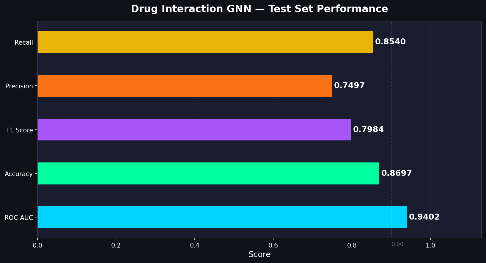
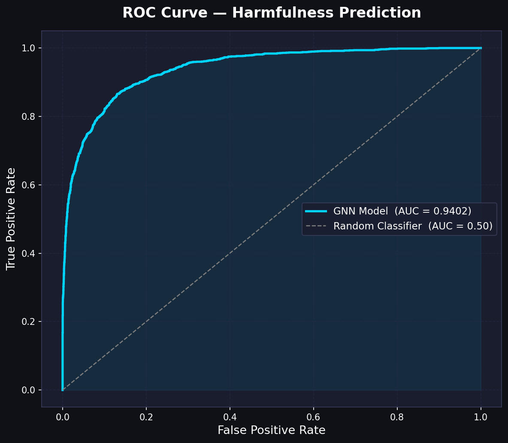
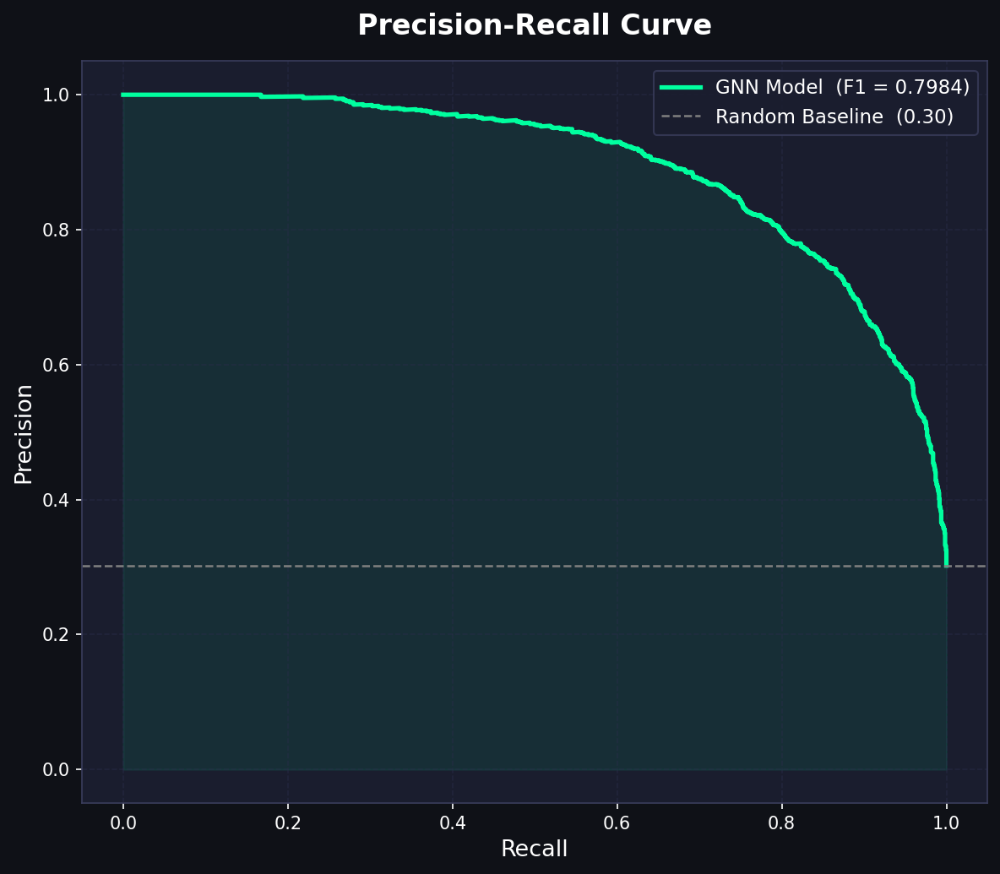
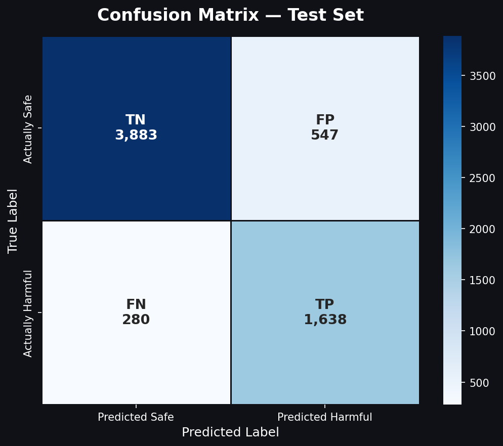
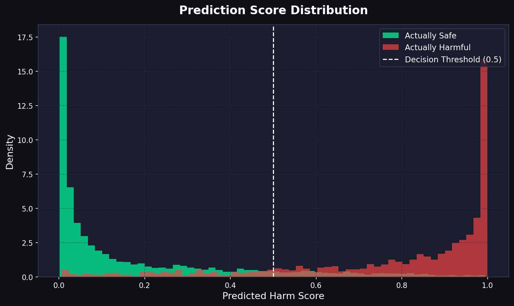
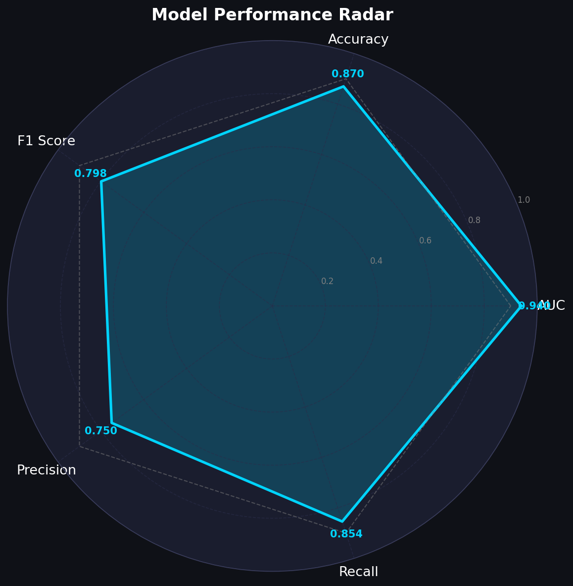

# Drug Interaction GNN

A multi-task Graph Neural Network that predicts polypharmacy side effects and classifies clinical harmfulness for drug combinations.

Given two or more drugs, the model predicts which of 1,317 known side effects are likely to occur and produces a harmfulness score for each pair.

---

## Problem

When drugs are co-prescribed, they can interact through shared protein targets and biological pathways. The number of possible combinations is too large for clinical testing. This model learns from known interactions to flag dangerous combinations before they reach patients.

---

## Dataset

Source: [DECAGON - Stanford SNAP](http://snap.stanford.edu/decagon/)  
Reference: Zitnik, Agrawal & Leskovec, *Bioinformatics* 2018

| File | Rows | Used For |
|---|---|---|
| bio-decagon-combo.csv | 4,649,441 | Training labels (drug pair side effects) |
| bio-decagon-targets.csv | 18,690 | Drug-protein binding edges |
| bio-decagon-ppi.csv | 715,612 | Protein-protein interaction edges |
| bio-decagon-mono.csv | 174,977 | Per-drug side effect features |
| bio-decagon-effectcategories.csv | ~994 | Side effect severity classification |
| chembl_37_chemreps.txt | ~2.4M | SMILES strings for Morgan fingerprints |

**Graph:** 21,257 nodes (2,135 drugs + 19,122 proteins), 1,820,238 edges  
**Labels:** 63,473 drug pairs evaluated against 1,317 side effects  
**Harmful pairs:** 19,173 (30.2%) - defined as pairs sharing >=20 severe systemic side effects

---

## Model

**DrugInteractionGNN** - three-stage architecture:

**1. Encoder (GraphSAGE, 2 layers)**  
Reads the full drug-protein-protein graph and produces a 128-dimensional embedding per node. Drug nodes are initialised from 18,355-dim feature vectors (2,048-dim Morgan fingerprint + 16,307-dim individual side effect profile). Protein nodes use learned embeddings.

**2. Side Effect Decoder (diagonal bilinear)**  
For a drug pair (i, j), scores each of 1,317 side effects using:

```
score(i, j, r) = sum( z_i * D_r * z_j )
```

where D_r is a learned 128-dim weight vector per side effect. Output: [pairs × 1317] probability matrix.

**3. Harmfulness Head (MLP)**  
Takes the side effect probability matrix and outputs a single harm score per pair via Linear(1317→128)→ReLU→Linear(128→1).

**Parameters:** 10,195,329 total  
**Loss:** 0.6 × BCE(side effects) + 0.4 × BCE(harmfulness), with per-class pos_weight for imbalance

---

## Results



| Metric | Score |
|---|---|
| ROC-AUC | **0.9402** |
| Accuracy | 0.8697 |
| F1 Score | 0.7984 |
| Precision | 0.7497 |
| Recall | 0.8540 |







On 6,348 held-out test pairs: 1,638 true positives, 280 false negatives, 547 false positives, 3,883 true negatives.



The model produces well-separated score distributions - safe pairs cluster near 0, harmful pairs near 1, with a clean decision boundary at 0.5.



---

## Project Structure

```
.
├── drug_interaction_gnn.ipynb   # data pipeline and training
├── main.py                      # FastAPI server
├── src/
│   ├── model.py                 # DrugInteractionGNN class
│   └── predict.py               # DrugInteractionPredictor (inference wrapper)
├── models/
│   └── best_model.pt            # trained checkpoint
├── data/
│   ├── processed/               # edge tensors, drug features, splits
│   └── mappings/                # drug/protein/SE index JSON files
└── presentation_charts/         # evaluation plots
```

---

## Running the API

```bash
conda activate pytorch_env
python main.py
```

Server starts at `http://localhost:8000`.

**Endpoints:**

```
GET  /        health check
GET  /drugs   list of all 2,135 valid drug IDs
POST /predict predict interactions for a list of drugs
```

**Example request:**

```bash
curl -X POST http://localhost:8000/predict \
  -H "Content-Type: application/json" \
  -d '{"drugs": ["CID000002173", "CID000003345"]}'
```

**Example response:**

```json
{
  "harmful": true,
  "confidence": 0.8712,
  "risk_level": "HIGH",
  "drug_count": 2,
  "pairs_analyzed": 1,
  "side_effects": [
    {
      "name": "Hypermagnesemia",
      "probability": 0.9134,
      "category": "Cardiac disorders",
      "severity": "CRITICAL"
    }
  ],
  "pair_details": [
    {
      "drug_a": "CID000002173",
      "drug_b": "CID000003345",
      "top_side_effects": ["Hypermagnesemia"],
      "pair_harm_score": 0.9241
    }
  ]
}
```

---

## Training Notes

Training was done on Google Colab (T4 GPU). The encoder runs once per epoch under `torch.no_grad()` to avoid storing the 1.8M-edge computation graph across batches. The checkpoint with the best validation AUC is saved automatically.

To retrain from scratch, run all cells in `drug_interaction_gnn.ipynb` in order. Processed assets can be exported with:

```bash
zip -r gnn_colab_assets.zip data/processed/ data/mappings/
```

---

## References

**Dataset**

- Zitnik M, Agrawal M, Leskovec J. Modeling polypharmacy side effects with graph convolutional networks. *Bioinformatics* 34.13 (2018): i457-i466. [paper](https://academic.oup.com/bioinformatics/article/34/13/i457/5045770)
- DECAGON dataset and download: [snap.stanford.edu/decagon](http://snap.stanford.edu/decagon/)
- SIDER side effect database: [sideeffects.embl.de](http://sideeffects.embl.de/download/) - files `meddra_all_se.tsv` and `meddra_freq.tsv`
- ChEMBL molecular structures: [ebi.ac.uk/chembl](https://ftp.ebi.ac.uk/pub/databases/chembl/ChEMBLdb/latest/) - file `chembl_37_chemreps.txt`

**Model**

- Hamilton WL, Ying R, Leskovec J. Inductive representation learning on large graphs. *NeurIPS* 2017. [paper](https://arxiv.org/abs/1706.02216)
- Rogers D, Hahn M. Extended-connectivity fingerprints. *J. Chem. Inf. Model.* 50.5 (2010): 742-754.
- Fey M, Lenssen JE. Fast graph representation learning with PyTorch Geometric. *ICLR Workshop* 2019.
